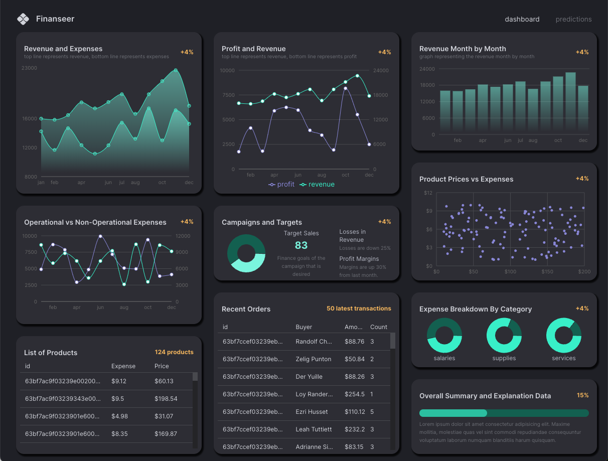

# Finance App Demo
#### A MERN Finance Dashboard with simple linear Financial Forcasting using Machine Learning
#### Based on this tutorial by Ed Roh
([Video here](https://www.youtube.com/watch?v=uoJ0Tv-BFcQ&t=522s)) ([GitHub here](https://github.com/ed-roh/finance-app/blob/master/README.md))

---

<video autoPlay muted width="200" height="400">
  <source src="./client/src/assets/finanseer-video.mp4">
</video>

### Check Out the App
- You can check out the hosted app at [https://finance-app-demo-3obgtm9at-bryson-palmer.vercel.app/](https://finance-app-demo-3obgtm9at-bryson-palmer.vercel.app/)
### Install the App Locally
- You could also:
  - Clone this repo
  - run `yarn install` dependencies
  - run `yarn run dev` to start the app locally on port **5173**

### Goal - Gain More Proficiency with:
- MERN full stack development
  - Express backend framework
  - MongoDB database
- Vite
- Typescipt
- Redux Toolkit & Query
- Material UI
- Recharts
  - A composable charting library built on React components
- Regression
  - A JavaScript module containing a collection of linear least-squares fitting methods for simple data analysis.
- Hosting and Deploying
  - **Frontend** with Vercel
  - **Backend** with fly.io & docker

#### My Experience
Another great tutorial by Ed Roh. He is putting some great content out there.
I really enjoyed using recharts. Lots of different chart types and easy to hook up. With some styling, they look great. It was also very easy to use regression for the best-fit line prediction. They have some other functions I would like to try out as well. This prediction page could definitely be expanded upon. Additionally, this was my first app using Typescript. I found it was very intuitive to read and write but I will need to keep writing with it to remember syntax. Another first, using Vercel, fly.io, and Docker. Hosting the frontend with Vercel was a quick and easy task but it was a bit more complicted to get the backend hosted and deployed on fly.io with Docker. After using Redux Bundler at my last job, I have really enjoyed using Redux ToolKit and Query. This app doesn't have complicated state but I see the set up process and useage is much simpler.
### Data
The database was seeded with initial data provided with tutorial.

  ---

### Dependencies
  ##### Backend
  - body-parser
  - cors
  - dotenv
  - express
  - helmet
  - mongoose
  - mongoose-currency
  - morgan
  - nodemon
  ##### Frontend
  - mui/material
  - mui/icons
  - mui/x-data-grid
  - redux/toolkit
  - react-router-dom
  - recharts
  - regression
  - types
  - vite
  - eslint
  - typescript